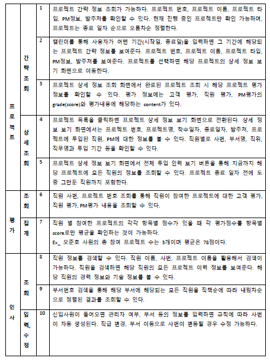

# DBproject ( 사내관리 프로그램 )

## 1. Problem Description

㈜프람트솔루션은 100명의 직원을 둔 SI업체로, 30명의 마케팅, 경영관리 및 연구개발 직원을 제외하면 70명의 개발자가 월 평균 10개 정도의 프로젝트를 수행하고 있다. 개발자들은 프로젝트 에 초기부터 종료 시까지 투입되기도 하고, 프로젝트에 일정 기간 동안만 투입되기도 한다. 프로젝트에 투입되는 개발자들은 경력과 기술 등급에 따라서 PM, PL, 분석자, 설계자, 프로그래머, 테스터 등 다양한 직무를 맡는다.

㈜프람트솔루션이 수행하는 프로젝트에 대해 프로젝트번호, 프로젝트명, 프로젝트 착수일자/종료일자, 발주처 등을 관리하고, 직원들에 대해서는 직원번호, 직원명, 주민등록번호, 최종학력을 관 리하며, 특히 프로젝트 투입 직원들에 대해서는 경력과 경험한 기술(Skill Set)들을 관리하고자 한다. 직원은 회원가입 페이지를 통해 자신의 정보를 데이터베이스에 저장하고 수정 변경할 수 있어야 한다. 직원 사번은 정해진 규칙에 의해서 자동으로 부여하는 것으로 가정하며, 회원가입 시 회원 로그인은 중복 체크 기능을 추가하여 기 등록 된 ID로 회원가입 신청을 할 경우 에러 메시지를 출력하고 중복되지 않는 신규 ID를 입력 할 수 있어야 한다.

경영진은 현재 ㈜프람트솔루션이 몇 개의 프로젝트를 수행하고 있고, 직원들이 현재 어느 프로 젝트에 몇 명이나 투입되어 있으며, 그들이 각각 어떤 직무를 수행하고 있고, 투입기간이 어떻게 되는지 등을 체계적으로 관리하길 원하고 있다. 이를 통해서 과거 특정 시점에 어떤 직원이 어느 프로젝트에 어떤 직무로 참여했었는지도 알 수 있고, 개인별 경력관리는 물론 인센티브 지급을 위한 기초자료까지 추출할 수 있다. 그러므로 경영진은 일반직원과는 다르게 타 직원들의 정보를 검색할 수 있는 권한이 있어야 한다.

직원들이 참여한 각 프로젝트에서는 프로젝트 종료 시점에 평가를 실시한다. 평가에는 고객 평가, PM 평가, 동료평가 등이 존재한다. 각평가는 평가자와 피평가자가 존재하고 평가 항목으로 는 업무수행 평가, 커뮤니케이션 능력평가가 있으며, 각 평가 항목 당 평점과 평가내용을 관리한다. 고객평가는 고객이 프로젝트에 참여한 참여사 직원들에 대해서 평가하는 것을 말한다. 프로젝트를 종료하는 시점에 PM이 주관하여 고객사의 담당자로부터 평가서를 의뢰하고 결과를 회사에 보고해야 한다. 동료평가는 프로젝트에 참여한 각 멤버들이 자기 이외의 프로젝트 참여자에 대해서 평가하는 것이다. 이중에서 PM 평가는 PM이 프로젝트 팀원을 평가하는 것을 말한다. 이러한 평가결과는 회사내부에서 인사고과와 인사평가의 근거 자료로 활용된다.

 

## 2. 팀원 소개

| 이름   | 역할 | 담당                         |
| ------ | ---- | ---------------------------- |
| 오준호 | 팀장 | Backend 개발 + 배포환경 구축 |
| 이일호 | 팀원 | Backend 개발                 |
| 전중석 | 팀원 | Backend 개발                 |
| 우상덕 | 팀원 | Frontend 개발                |
| 소유정 | 팀원 | Frontend 개발                |
| 민지   | 팀원 | Frontend 개발                |

 

## 3. 프로젝트 구현 범위 정리

프로젝트 범위를 정하기 위해 요구사항정의서를 기반으로 프로젝트 정보, 인사, 평가 정보를 조회하고 수정하는 것은 전부 수용을 했으며, 인센티브 지급을 위한 자료 추출에 관한 기능, 로그인 시 비밀번호 찾기 기능, 직원 퇴사 시 로그인 정보 삭제 기능 등은 미수용 했습니다.

회원가입이나 데이터 수정과 같은 기본적인 기능들을 제외하고 수용한 상세범위는 하단의 2. 기능 요구사항 표를 통해 확인 가능 합니다.
직원, 프로젝트 정보를 활용한 검색을 통해 직원, 프로젝트, 평가내용에 해당하는 여러가지 정보들을 조회할 수 있는 각종 기능들과 직급 변경이나 부서 이동시 사번 수정 기능 등을 구현할 범위로 정하였습니다.

 

 

## 4. 개발 언어 및 환경

⚫ 데이터베이스 설계 도구: ERWin  
⚫ DBMS: MariaDB, MySQL, ClearDB  
⚫ 소스코드 관리: Git, Github  
⚫ 프로그래밍 언어: Javascript  
⚫ 개발 프레임워크: Express.js, React.js, Pug  
⚫ 배포(호스팅): Heroku  

 

 

## 5. ERD

 

 

## 6. 주요 기능

 

⚫ 웹페이지는 로그인/회원가입 부분, 인사 관리, 프로젝트 보기,관리, 평가 관리로 크게
구현을 하였다. 회원가입 부분에서 정보를 입력 후 회원가입을 하면 sql문을 통해
id,비번 등 개인정보를 데이터베이스에 삽입하고 auto increment 기능을 이용하여 사번을
자동으로 생성하도록 구성하였다. 

⚫ 인사 관리 페이지에서 인사 정보 조회를 통해 정보를 검색 할 수 있다. FORM 에서
입력을 통해 검색을 하면 sql 문을 통해 db 에서 관련 정보들을 가져와서 테이블의
형태로 보여준다. 

⚫ 인사 관리 페이지에서 부서 정보 조회는 FORM 에서 부서번호를 입력받아 검색을 하면
sql 문을 통해 부서의 직책순으로 내림차순 정렬을 하여 테이블로 나타낸다. 인사 정보
등록, 수정은 form 을 통해 입력을 받아 내용을 db 에 삽입 또는 수정하도록 구성하였다. 

⚫ 프로젝트 관리 페이지에는 프로젝트 정보 등록,수정,조회의 탭들이 있으며 정보 등록
페이지에는 form 을 통해 프로젝트에 대한 정보를 입력 받아 sql 문을 통해 db 에
저장한다. 정보 수정 페이지 에는 form 에서프로젝트에 대한 정보를 입력받으면 해당
프로젝트에 대한 정보와 참여 팀원들을 나타내고 프로젝트에 대한 정보를 수정하면
sql문을 통해 db에 저장한다. Form에서 프로젝트 번호와 직원이름을 검색하면 sql문으로
이름에 해당하는 직원을 보여주고 직무 아이디를 입력하여 해당 프로젝트에
참여직원으로 추가한다.프로젝트 정보 조회 페이지에서는 From 에서 프로젝트 번호를
입력 받아 해당 프로젝트가 완료되었으면 sql 문을 이용해 고객,pm,직원 평가에 해당하는
내용들을 조회할 수 있다. 해당 프로젝트가 완료되지 않으면 프로젝트에 대한 정보만을
보여준다. 

⚫ 프로젝트 보기 탭에는 FORM 을 통해 시작일과 종료일 을 입력받으면 sql 문을 이용해
프로젝트 간략 정보를 보여주고 프로젝트를 선택하면 상세정보 보기 화면으로 이동한다.
프로젝트 상세 정보에서 프로젝트에 끝까지 참여한 직원들에 대한 정보를 볼 수 있고
버튼을 누르면 중간에 참여를 종료한 직원들까지 볼 수 있다. 

⚫ 평가 조회에서는 인사, PM, 동료 평가에 대한 모든 결과를 한번에 조회 가능하다.
평가관리에서는 사번과 프로젝트 번호를 FORM에 입력 받아 조회하면 sql문을 통해
평가들에 대한 정보들을 테이블로 나타낸다. 직원 별로 참여한 프로젝트가 많기 때문에
사번과 프로젝트 번호를 정확히 입력하도록 했다. 각 테이블에 사번, 프로젝트 번호
정보로 where절에 조건을 줘서 해당 평가 정보를 보여줬다. 평가 관리에서 평가 항목
평균을 조회 할 수 있는데 form을 통해 사번과 항목을 입력 받으면 sql문의
aggregation함수를 이용하여 이름 총 참여 프로젝트 개수 항목 평균점수를 조회 가능하게
하였다  

# 산출물

### 산출물 목차

1. **프로젝트 간략 조회**
2. **프로젝트 간략 조회**
3. **완료된 프로젝트의 평가 정보 조회**
4. **프로젝트 상세 조회**
5. **프로젝트 참여 모든 직원 조회**
6. **평가 정보 조회**
7. **항목 평균 조회**
8. **인사 정보 조회**
9. **부서 조회**
10. **인사 입력, 수정**
11. **로그인**
12. **인사 정보 등록 & 수정**
13. **평가 정보 입력 > 동료 평가 정보**
14. **평가 정보 수정 > 동료 평가 정보**
15. **평가 정보 입력 > 고객 평가 정보**
16. **평가 정보 수정 > 고객 평가 정보**
17. **평가 정보 입력 > PM 평가 정보**
18. **평가 정보 수정 > PM 평가 정보**
19. **프로젝트 정보 등록**
20. **프로젝트 정보 수정**

### 1. 프로젝트 간략 조회

프로젝트 간략 정보 조회가 가능하다. 프로젝트 번호, 프로젝트 이름, 프로젝트 타입, 발주처 등을 확인할 수 있다. 프로젝트는 종료 일자 순으로 오름차순으로 정렬한다.

### 2. 프로젝트 간략 조회

캘린더를 통해 사용자가 기간(시작일, 종료일)을 입력하면 그 기간에 해당되는 프로젝트 간략 정보를 보여준다. 프로젝트 번호, 프로젝트 이름, 프로젝트 타입, 발주처 등을 보여준다. 프로젝트를 선택하면 해당 프로젝트의 상세 정보 보기 화면으로 이동한다.

### 3. 완료된 프로젝트의 평가 정보 조회

프로젝트 정보 조회 시, 완료되어 평가 정보가 존재하는 프로젝트의 경우 그 프로젝트 에 존재하는 모든 평가 정보들을 조회할 수 있다. 각 평가 항목 당 평가 내용(평가 점수, 코멘트 포함)을 조회할 수 있다.

### 4. 프로젝트 상세 조회

프로젝트 목록을 클릭하면 프로젝트 상세 정보 보기 화면으로 전환된다. 상세 정보 보기 화면에서는 프로젝트 번호, 프로젝트명, 착수일자, 종료일자, 발주처, 프로젝트에 투입된 직원, PM에 대한 정보를 볼 수 있다. 직원별로 사번, 부서명, 직위, 직무명과 투입 기간 등을 확인할 수 있다.

### 5. 프로젝트 참여 모든 직원 조회

프로젝트 상세조회 화면에서 팀원목록은 프로젝트에 끝까지 참여하고 있는 직원들 만을 보여주는데 조회버튼을 누르면 중간에 프로젝트 참여를 종료한 직원들까지 모두 볼 수 있다.

조회버튼 클릭

### 6. 평가 정보 조회

사번, 프로젝트 번호로 평가 정보를 조회할 수 있는 기능이다. 고객, PM, 동료 평가 모두 확인 가능하다. 항목 별 점수, 코멘트 데이터를 조회할 수 있다.

### 7. 항목 평균 조회

사번을 이용하여 참여한 프로젝트의 항목별 점수가 있을 때 평가점수를 score로 평균을 조회한다. 항목별로 직원평가, PM평가, 고객평가가 존재하며 업무수행과 커뮤니케이션 능 력에 대하여 점수 평균 조회를 할 수 있다.

### 8. 인사 정보 조회

직원 관리의 인사정보 조회를 통해 직원에 대한 정보를 검색할 수 있다.직원을 검색하면 직원에 대한 정보와 직원이 어떤 프로젝트에 참여하였는지 해당직원의 경력 정보와 기술 정보를 볼 수 있다. 검색어 옆에 사번 을 선택하고 사번을 입력하여 검색 버튼을 누르면 사번으로 조회가 가능하고 직원 이름을 선택하고 직원이름을 입력후 검색버튼을 누르면 직원이름을 조회가 가능하다.

이름으로 조회

조회 버튼 클릭

사번으로 조회

조회 버튼 클릭

### 9. 부서 조회

부서 조회 UI를 통해 부서번호를 검색하면 해당 부서에 있는 사원들이 나오고 이 때 사원들은 직책 순에 따라 내림차순 정렬이 된 상태로 출력되도록 구현했다. 앞서 회원가입을 할 때 넣었던 이름이 확인인 사람은 IT 부서 소속이므로 캡처 사진에서 출력된 것을 확인할 수 있다.

### 10. 인사 입력, 수정

신입사원이 들어와 회원가입을 하면 관리자 여부, 부서 등의 정보를 입력하면 MYSQL의 기 능인 AUTO_INCREMENT를 이용하여 값이 1씩 저장한 값을 사번으로 자동으로 생성해준다.
그리고 직급 변경이나 부서이동으로 사번이 변동될 경우 수정이 가능하게 구현했다.

원래 사번이 74 직급이 4인 이름 확인이라는 사람의 사원번호를 888 직급을 4로 변경

변경된 내용을 부서 조회(IT)로 확인

방금 직급과 사번을 변경한 확인 이름을 가진 사람의 사번을 777 부서를 PL로 변경

PL 부서 조회를 통해 변경 값 확인

### 11. 로그인

방금 위에서 삽입하였던 항목으로 로그인 기능을 하는 캡처 사진이다.

아이디에 확인을 넣었고 비밀번호에 방금 삽입한 비밀번호를 삽입하여서 로그인 버튼을 누르면 main 페이지로 이동하게 구현하였다.

### 12. 인사 정보 등록 & 수정

‘인사 정보 등록’ 페이지에서 사번, 성명, 주민등록번호, 최종학력, 입사 일자, 웹 아이디, 비밀번호, 관리자인지 일반 사원인지의 정보를 등록하면 DB에 입력한 값들이 저장되어 인 사 정보 등록이 가능하다.

‘인사 정보 수정’ 페이지에서 이미 존재하는 직원의 인사 정보를 수정할 수 있다. 이 때, 사번은 변경할 수 없으며, 입력한 사번과 일치하는 직원의 인사 정보 수정이 가능하다. 항 목은 인사 정보 등록 항목과 동일하나 추가로, 퇴사 일자를 수정(등록)할 수 있다.

### 13. 평가 정보 입력 > 동료 평가 정보

동료 평가 정보 테이블(emp_evl, emp_p_evl)에 데이터를 삽입할 수 있는 기능이다. 현재는 모든 column을 다 입력해야 삽입이 가능하도록 구현하였다.

INSERT 전

employee_evl 테이블

employee_p_evl 테이블

입력 버튼 누른 후

Insert 결과

### 14. 평가 정보 수정 > 동료 평가 정보

동료 평가 정보 테이블(emp_evl, emp_p_evl)에 데이터를 수정 (update) 할 수 있는 기능이다. 현재는 모든 column을 다 입력해야 수정이 가능하도록 구현하였다.

동료 평가시 넣은 정보를 수정함.

수정 후

### 15. 평가 정보 입력 > 고객 평가 정보

고객 평가 정보 테이블(customer_evl)에 데이터를 삽입할 수 있는 기능이다. 현재는 모든 column을 다 입력해야 삽입이 가능하도록 구현하였다.

등록 전 테이블

등록 후

### 16. 평가 정보 수정 > 고객 평가 정보

고객 평가 정보 테이블(customer_evl)에 데이터를 수정 (update) 할 수 있는 기능이다. 현재는 모든 column을 다 입력해야 수정이 가능하도록 구현하였다.

수정 전

수정 후

### 17. 평가 정보 입력 > PM 평가 정보

PM 평가 정보 테이블(pm_evl)에 데이터를 삽입할 수 있는 기능이다. 현재는 모든 column을 다 입력해야 삽입이 가능하도록 구현하였다.

입력 전 pm_evl 테이블

등록

등록 결과

### 18. 평가 정보 수정 > PM 평가 정보

PM 평가 정보 테이블(pm_evl)에 데이터를 수정 (update) 할 수 있는 기능이다. 현재는 모든 column을 다 입력해야 수정이 가능하도록 구현하였다.

PM 평가 정보 등록시 사용한 데이터를 수정함.

수정 결과

### 19. 프로젝트 정보 등록

프로젝트 정보를 등록할 수 있는 기능이다. 프로젝트 번호, 프로젝트명, 착수-종료 일자 발 주처, 프로젝트 규모를 입력하고 등록을 누르면 project 테이블에 정보가 삽입된다.

등록 전 프로젝트 테이블

등록

결과

### 20. 프로젝트 정보 수정

프로젝트의 정보를 수정할 수 있는 기능이다. 프로젝트 정보 수정에서는 프로젝트 정보에 대한 수정, 참여 직원 추가를 할 수 있다.

프로젝트 번호로 조회하면 프로젝트에 대한 정보가 입력이 된다. 수정을 한 후에 버튼을 누르면 update 문이 실행된다.

팀원을 추가할 때는 추가할 프로젝트명을 입력하고 참여할 이름을 조회한다. 직원을 추가할 때는 참여할 사람의 직무아이디도 함께 넣어서 등록해야한다.

프로젝트 정보 수정 시에는 먼저 프로젝트 번호로 조회를 한다.

조회 결과가 input 안의 value로 들어간다. (프로젝트 규모, 착수 일자, 종료 일자 변경)

수정 후 버튼을 누른다.

잘못된 정보 저장 시 오류임을 안내한다.

Project table의 정보가 수정된 것을 볼 수 있다.

